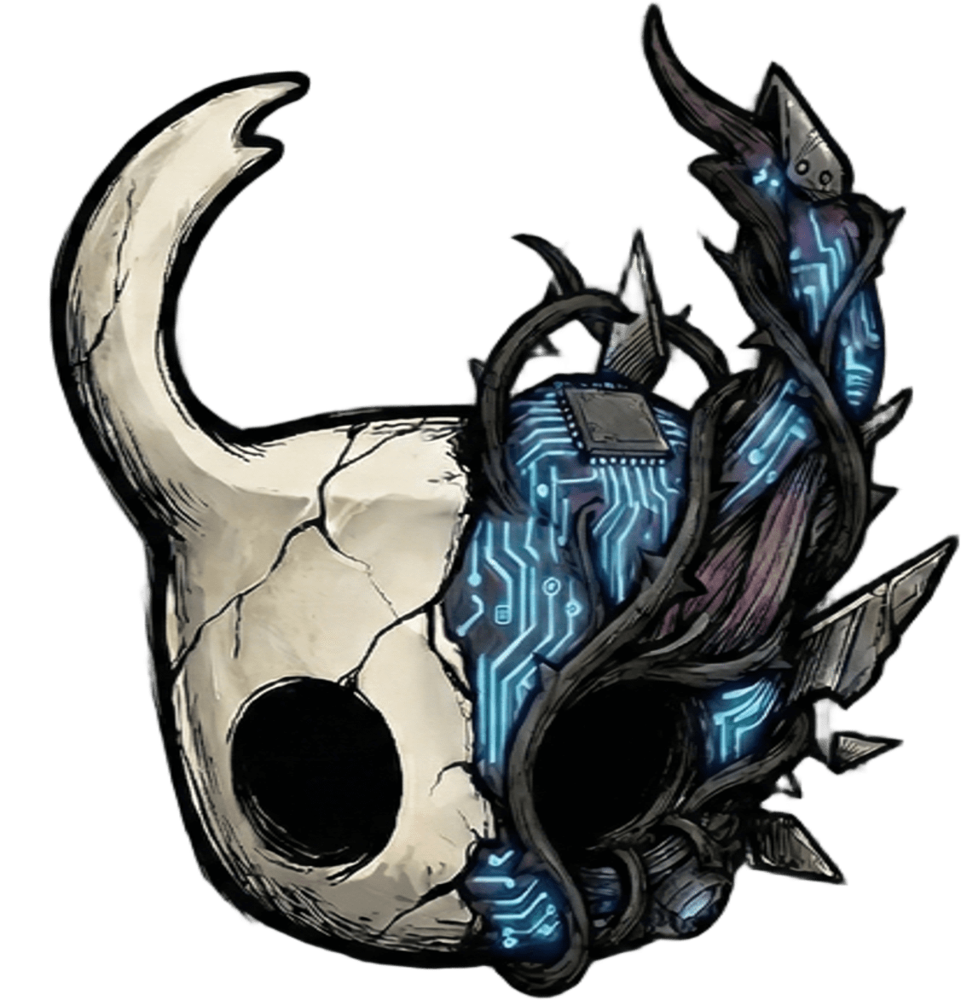

<div align="center">



# SyntheticSoul: Hollow Knight RL Challenge

[](https://www.python.org/)
[](https://pytorch.org/)
[](https://docs.microsoft.com/en-us/dotnet/csharp/)
[](https://teamcherry.com.au/hollowknight/)
[](https://opensource.org/licenses/MIT)

**Agenti di Deep Reinforcement Learning (PPO & DQN) addestrati per sconfiggere le Mantis Lords nella Hall of Gods di Hollow Knight.**

[Caratteristiche](#-caratteristiche) • [Architettura](#-architettura) • [Installazione](#-installazione) • [Training](#-training) • [Risultati](#-risultati) • [Contribuire](#-contribuire)

</div>

---

## 📖 Introduzione

**SyntheticSoul** è un framework sperimentale che collega l'ambiente di gioco di *Hollow Knight* con agenti di Intelligenza Artificiale avanzati basati su Deep Reinforcement Learning.

L'obiettivo principale del progetto è addestrare un'IA in grado di completare autonomamente la sfida **Mantis Lords** nella *Hall of Gods* (Godhome). Il sistema implementa una mod C# personalizzata che espone lo stato del gioco in tempo reale e riceve comandi di input tramite socket TCP, permettendo agli agenti Python di apprendere strategie complesse di combattimento, schivata e posizionamento.

### 🎯 Obiettivi del Progetto

- Dimostrare l'applicabilità del Deep RL in ambienti di gioco complessi non nativamente progettati per l'IA
- Sviluppare tecniche di reward shaping efficaci per boss fight dinamici
- Creare un framework modulare riutilizzabile per altre sfide di Hollow Knight

---

## ✨ Caratteristiche

### 🧠 Intelligenza Artificiale

- **PPO (Proximal Policy Optimization):** Implementazione Actor-Critic con supporto **LSTM** per gestire la memoria temporale (fondamentale per tracciare i boomerang delle mantidi e predire pattern di attacco)
- **DQN (Deep Q-Network):** Implementazione con Experience Replay Buffer e Target Network per un apprendimento stabile off-policy
- **Reward Shaping Avanzato:** Sistema di ricompense dinamico basato su:
  - Danni inflitti vs subiti con coefficienti di penalità
  - Distanza ottimale dal nemico (combat spacing)
  - Schivata tempestiva di proiettili e pericoli ambientali
  - Progressione specifica (tracking delle 3 Mantidi eliminate individualmente)
  - Bonus per utilizzo efficace delle meccaniche (parry, dash, healing timing)

### 🛠️ Modding & Core (C#)

- **State Extraction:** Sistema di raycasting in tempo reale per rilevare terreno, muri, piattaforme e ostacoli
- **Hazard Detection:** Rilevamento automatico di proiettili, nemici e hazard con calcolo della velocità relativa e traiettoria
- **Virtual Controller:** Wrapper di input virtuale che permette all'IA di controllare il Cavaliere senza richiedere il focus della finestra di gioco
- **Auto-Reload:** Sistema automatico per ricaricare la battaglia "GG_Mantis_Lords" alla morte o alla vittoria, permettendo training 24/7 non supervisionato
- **Performance Optimization:** Comunicazione asincrona con rate limiters per mantenere 60 FPS stabili

---

## 🏗 Architettura

Il sistema opera su un'architettura Client-Server a bassa latenza (~20Hz):

```
┌─────────────────────────┐         ┌──────────────────────────┐
│   Hollow Knight Game    │         │    Python RL Agent       │
│                         │         │                          │
│  ┌──────────────────┐   │         │  ┌────────────────────┐  │
│  │ State Extractor  │   │  JSON   │  │   PPO/DQN Network  │  │
│  │  - Raycast       │───┼────────►│  │   - Actor-Critic   │  │
│  │  - Hazard Detect │   │ TCP     │  │   - LSTM Memory    │  │
│  │  - HP Tracking   │   │ :5555   │  │   - Replay Buffer  │  │
│  └──────────────────┘   │         │  └────────────────────┘  │
│                         │         │                          │
│  ┌──────────────────┐   │ Action  │  ┌────────────────────┐  │
│  │ Action Executor  │◄──┼─────────┤  │  Action Selection  │  │
│  │  - Virtual Input │   │ String  │  │  - Exploration     │  │
│  └──────────────────┘   │         │  └────────────────────┘  │
└─────────────────────────┘         └──────────────────────────┘
```

**Server (Mod C#):** In ascolto sulla porta 5555. Estrae dati (HP, Posizione, Nemici, Terreno, Hazards) a 20Hz e li serializza in JSON.

**Client (Python):** Processa lo stato tramite reti neurali PyTorch, decide l'azione ottimale (Attacco, Salto, Dash, Magia, Focus) e la invia al gioco.

---

## 📂 Struttura del Progetto

```
SyntheticSoul/
├── AI_Agents/                    # Core Python per Deep RL
│   ├── scripts/                  # Script di avvio training
│   │   ├── train_dqn.py          # Training Loop DQN
│   │   └── train_ppo.py          # Training Loop PPO
│   ├── src/
│   │   ├── agents/               # Logica degli agenti
│   │   │   ├── dqn_agent.py      # Implementazione DQN
│   │   │   └── ppo_agent.py      # Implementazione PPO con LSTM
│   │   ├── env/                  # Wrapper Environment
│   │   │   └──hollow_knight_env.py         # Gym-like environment
│   │   ├── utils/                # Utilità
│   │   │   └── generate_plots.py # Grafici training
│   │   └── requirements/
│   │       └── requirements.txt  # Dipendenze Python
│   └── checkpoints/              # Salvataggio modelli (.pth)
│       ├── checkpoints_ppo_mantis/
│       └── checkpoints_dqn/
│
├── HollowKnightMod/              # Mod Unity C#
│   ├── src/
│   │   ├── GameStateExtractor.cs # Estrazione stato gioco e Raycast
│   │   ├── ActionExecutor.cs     # Controller virtuale
│   │   ├── SocketCommunicator.cs # Server TCP asincrono
│   │   └── SyntheticSoulMod.cs   # Main Mod Entry & Hooks
│   └── SyntheticSoul.csproj      # Progetto Visual Studio
│
├── assets/                       # Risorse grafiche
│   └── logo_grande.jpg
│
├── LICENSE                       # Licenza MIT
└── README.md                     # Questo file
```

---

## 🚀 Installazione

### Prerequisiti

- **Hollow Knight** (Steam/GOG) installato su PC Windows/Linux
- **Modding API:** [Scarab](https://github.com/fifty-six/Scarab) o [Lumafly](https://github.com/TheMulhima/Lumafly) installato
- **Python 3.8+** con pip
- **Visual Studio 2022** (per compilare la mod, opzionale se usi release pre-compilate)
- **.NET Framework 4.7.2** o superiore

### 1. Installazione della Mod

#### Opzione A: Usa la Release Pre-compilata (Consigliato)

1. Scarica l'ultima release da [Releases](https://github.com/jlgionny/SyntheticSoul/releases)
2. Estrai `SyntheticSoulMod.dll` nella cartella:
   ```
   <Hollow Knight Directory>/hollow_knight_Data/Managed/Mods/
   ```
3. Avvia il gioco - la mod si caricherà automaticamente

#### Opzione B: Compila da Sorgente

1. Apri la soluzione `HollowKnightMod/SyntheticSoul.sln` con Visual Studio 2022
2. Verifica i riferimenti alle DLL di Unity (dovrebbero puntare a):
   ```
   <Hollow Knight Directory>/hollow_knight_Data/Managed/
   ├── UnityEngine.dll
   ├── Assembly-CSharp.dll
   └── Modding API.dll
   ```
3. Compila in modalità **Release** (Ctrl+Shift+B)
4. La DLL verrà generata in `bin/Release/SyntheticSoulMod.dll`
5. Copia manualmente la DLL nella cartella Mods

### 2. Setup Python

```bash
# Clona il repository
git clone https://github.com/jlgionny/SyntheticSoul.git
cd SyntheticSoul/AI_Agents

# Crea ambiente virtuale
python -m venv venv

# Attiva l'ambiente virtuale
# Windows:
venv\Scriptsctivate
# Linux/Mac:
source venv/bin/activate

# Installa le dipendenze
pip install -r src/requirements/requirements.txt
```

### 3. Verifica Installazione

1. Avvia Hollow Knight
2. Carica un salvataggio con accesso alla Hall of Gods
3. Controlla il file di log sul Desktop: `SyntheticSoul_Debug.txt`
4. Dovresti vedere: `[SyntheticSoul] Server TCP in ascolto su porta 5555`

---

## 🎮 Utilizzo (Training)

### Preparazione

1. **Avvia Hollow Knight** e carica un salvataggio con Godhome sbloccato
2. Posizionati davanti alla statua **Mantis Lords** nella Hall of Gods
3. **Attendi** che il server TCP della mod sia pronto (controlla `SyntheticSoul_Debug.txt` sul Desktop)
4. La mod inizierà automaticamente la battaglia quando rileva la connessione dell'agente

### Training PPO (Consigliato per Mantis Lords)

PPO gestisce meglio le azioni continue e la memoria temporale richiesta per tracciare i pattern delle mantidi.

```bash
cd AI_Agents
python scripts/train_ppo.py --episodes 5000 --lr 0.0003 --gamma 0.99
```

**Parametri disponibili:**
- `--episodes`: Numero di episodi di training (default: 5000)
- `--lr`: Learning rate (default: 0.0003)
- `--gamma`: Discount factor (default: 0.99)
- `--batch_size`: Dimensione batch per update (default: 64)
- `--save_interval`: Salva checkpoint ogni N episodi (default: 100)
- `--lstm`: Abilita memoria LSTM (default: True)

### Training DQN

DQN è più stabile ma meno adatto per spazi d'azione continui. Utile per esperimenti comparativi.

```bash
python scripts/train_dqn.py --episodes 3000 --epsilon_decay 0.995
```

**Parametri disponibili:**
- `--episodes`: Numero di episodi (default: 3000)
- `--epsilon_start`: Epsilon iniziale per exploration (default: 1.0)
- `--epsilon_end`: Epsilon finale (default: 0.01)
- `--epsilon_decay`: Decay rate epsilon (default: 0.995)
- `--buffer_size`: Dimensione replay buffer (default: 100000)
- `--target_update`: Frequenza update target network (default: 10)

### Monitoraggio in Tempo Reale

Durante il training, il sistema logga automaticamente metriche in:
```
checkpoints_ppo/training_log.txt
checkpoints_dqn/training_log.txt
```

Puoi monitorare i progressi con:
```bash
tail -f checkpoints_ppo/training_log.txt
```

### Generazione Grafici

I grafici vengono generati automaticamente ogni 100 episodi, ma puoi crearli manualmente:

```bash
python src/utils/generate_plots.py --log checkpoints_ppo/training_log.txt --type ppo --output plots_ppo/
```

---

## 📊 Risultati e Metriche

Il sistema produce dashboard dettagliate sull'andamento del training:

### Metriche Principali

1. **Cumulative Reward:** Andamento dell'apprendimento nel tempo
2. **Mantis Lords Killed:** Numero di mantidi sconfitte per episodio (0-3)
3. **Episode Length:** Durata media della sopravvivenza
4. **Loss (Actor/Critic):** Convergenza delle reti neurali
5. **Win Rate:** Percentuale di vittorie sugli ultimi 100 episodi

### Risultati Attesi

Dopo ~2000 episodi di training PPO con LSTM:
- **Win Rate:** 45-60%
- **Average Reward:** 800-1200
- **Avg Mantis Killed:** 2.1-2.5
- **Episode Length:** 180-250 secondi

### Visualizzazioni

Il sistema genera automaticamente:
- Grafici di reward cumulativo con smoothing
- Heatmap delle posizioni durante combattimento
- Distribuzione delle azioni intraprese
- Analisi temporale dei danni subiti vs inflitti

---

## 🔧 Troubleshooting

### Problema: "Connection Refused" in Python

**Soluzione:**
1. Verifica che Hollow Knight sia avviato con la mod installata
2. Controlla il file `SyntheticSoul_Debug.txt` per errori
3. Assicurati che nessun firewall blocchi la porta 5555
4. Prova a riavviare il gioco

### Problema: La mod non si carica

**Soluzione:**
1. Verifica che la Modding API sia installata correttamente
2. Controlla che la DLL sia nella cartella `Mods/` corretta
3. Controlla i log di Hollow Knight in `%appdata%/../LocalLow/Team Cherry/Hollow Knight/`

### Problema: L'agente non impara

**Soluzione:**
1. Riduci il learning rate: `--lr 0.0001`
2. Aumenta l'exploration: `--epsilon_decay 0.999` (DQN)
3. Verifica che il reward shaping sia bilanciato nei log
4. Controlla che l'LSTM sia abilitato per PPO

---

## 🤝 Contribuire

Le Pull Request sono benvenute! Per modifiche importanti, apri prima una issue per discutere cosa vorresti cambiare.

### Aree di Interesse

Attualmente cerchiamo contributi per:

- **Ottimizzazione algoritmi:** Implementazione di SAC (Soft Actor-Critic) o Rainbow DQN
- **Reward shaping:** Miglioramenti al sistema di ricompense per convergenza più rapida
- **Nuovi boss:** Estensione del framework ad altri boss di Godhome
- **Hazard detection:** Migliorare la stabilità del rilevamento proiettili "boomerang"
- **Curriculum learning:** Implementare training progressivo su boss di difficoltà crescente
- **Documentazione:** Tutorial video, guide avanzate, traduzione in altre lingue

### Come Contribuire

1. Fai un fork del progetto
2. Crea un branch per la tua feature (`git checkout -b feature/AmazingFeature`)
3. Commit delle modifiche seguendo [Conventional Commits](https://www.conventionalcommits.org/)
4. Push al branch (`git push origin feature/AmazingFeature`)
5. Apri una Pull Request con descrizione dettagliata

---

## 📚 Risorse e Riferimenti

- **Paper PPO:** [Proximal Policy Optimization Algorithms](https://arxiv.org/abs/1707.06347)
- **Paper DQN:** [Playing Atari with Deep Reinforcement Learning](https://arxiv.org/abs/1312.5602)
- **Hollow Knight Modding:** [HK Modding API Docs](https://hk-modding.github.io/HollowKnight.Modding/)
- **PyTorch RL Tutorial:** [Deep RL Course](https://huggingface.co/learn/deep-rl-course)

---

## 📄 Licenza

Distribuito sotto licenza **MIT**. Vedi [LICENSE](LICENSE) per maggiori informazioni.

Questo progetto non è affiliato con o approvato da Team Cherry. Hollow Knight è un marchio registrato di Team Cherry.

---

## 👤 Autori

**jlgionny**

- GitHub: [@jlgionny](https://github.com/jlgionny)

**jlgionny**

**jlgionny**

**jlgionny**

---

## 🙏 Ringraziamenti

- **Team Cherry** per aver creato Hollow Knight
- **HK Modding Community** per la Modding API e supporto
- **OpenAI Spinning Up** per le reference implementations di PPO
- Tutti i contributori e tester del progetto

---

<div align="center">

**Se questo progetto ti è stato utile, considera di lasciare una ⭐ su GitHub!**

</div>
